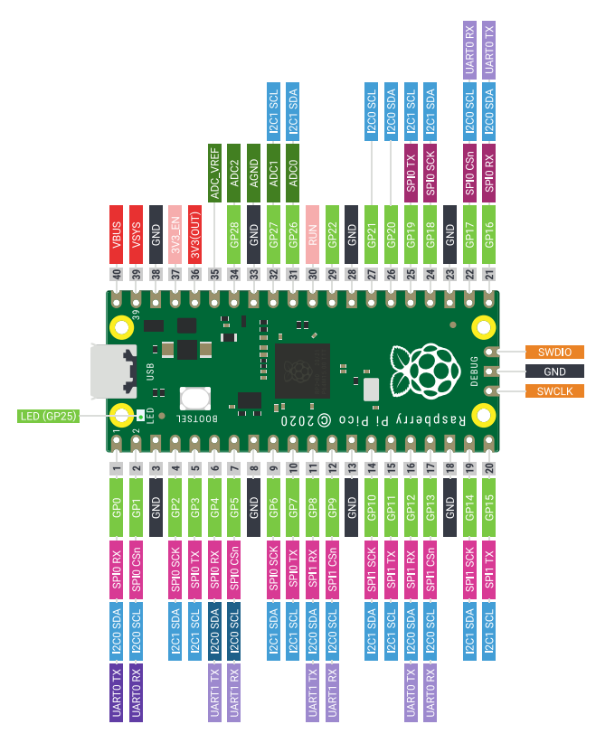
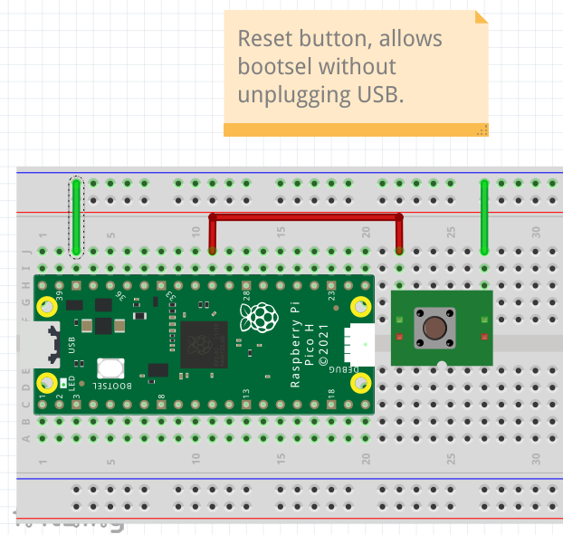

# Intro to Pi Pico MCU Programming in C from a Linux workstation

This is a brief introduction to C programming on the Pi Pico Micro 
Controller in the C language from Linux workstation.

## Prerequisites

- Pi Pico MCU.
- USB cable to connect the Pi Pico to the workstation.
- Linux workstation (Fedora 37 was used in the intro).

## Optional

- Prototyping breadboard.
- Momentary push button switch (normally open).
- Hookup wire.

## Reference Links

- Fedora Linux: [https://getfedora.org/](https://getfedora.org/)
- Raspberry Pi Pico: [https://www.raspberrypi.com/products/raspberry-pi-pico/](https://www.raspberrypi.com/products/raspberry-pi-pico/)
- Pi Pico SDK: [https://github.com/raspberrypi/pico-sdk](https://github.com/raspberrypi/pico-sdk)


## Workstation Setup

The Linux workstation will require some software packages installed
before developing an application for the Pi Pico. You can use your
favored editor and terminal application, but you will also need *git*, *cmake*, and *g++*.

(Fedora 37 install command)

> sudo dnf install git cmake g++

The ARM cross compilers and libraries are also needed to compile 
and link binaries for the ARM processor on the Pi Pico.

(Fedora 37 install commands)

> sudo dnf install arm-none-eabi-gcc-cs
> sudo dnf install arm-none-eabi-gcc-cs-c++
> sudo dnf install arm-none-eabi-newlib


## Clone Pi Pico SDK

NOTE: You may want to create a project folder to hold all the 
project files that will be downloaded and created.

The Pi Pico SDK can be cloned from the raspberrypi github
repository.

(Clone pico-sdk project and update submodules)

> git clone https://github.com/raspberrypi/pico-sdk
> cd pico-sdk
> git submodule update --init

Return to the project root directory and export the path 
environment variable for the pico-sdk.

> cd ..
> export PICO_SDK_PATH=~/Projects/pico-sdk/


## LED Blink

The Pi Pico board includes an integrated LED that is tied 
to GPIO 25 on the board. We will use this LED in a new blink 
project.

[Pi Pico pinout](https://datasheets.raspberrypi.com/pico/Pico-R3-A4-Pinout.pdf)




### Project Directory

Create the directory for the blink project and enter directory.

> mkdir blink
> cd blink


### Configure cmake

Copy the pico_sdk_import.cmake file into the project path.

> cp ../pico-sdk/external/pico_sdk_import.cmake ./

Create the CMakeLists.txt file for the project and edit.

> touch CMakeLists.txt

(edit file)
```
cmake_minimum_required(VERSION 3.12)
include(pico_sdk_import.cmake)

project(blink)
set(CMAKE_C_STANDARD 11)
set(CMAKE_CXX_STANDARD 17)

pico_sdk_init()

add_executable(blink blink.c)

target_link_libraries(blink pico_stdlib)
pico_add_extra_outputs(blink)
```


### Project source code

Create the blink.c source file and edit.

> touch blink.c

(edit file)
```c
#include "pico/stdlib.h"

#define LED_PIN 25

int main() {
  gpio_init(LED_PIN);
  gpio_set_dir(LED_PIN, GPIO_OUT);

  while (true) {
    gpio_put(LED_PIN, 1);
    sleep_ms(2000);
    gpio_put(LED_PIN, 0);
    sleep_ms(2000);
  }
}
```


### Build project

Create the build directory and build the project.

> mkdir build
> cd build
> cmake ..
> make

At this point the build directory should contain all 
the build files including the blink.uf2 file for the 
Pi Pico.


### Copy blink.uf2 to Pi Pico

Connect the USB cable to the Linux workstation, and
while holding down the *bootsel* button on the Pi Pico 
connect the USB cable to the Pi Pico.

After a moment the Pi Pico should be mounted as a USB 
mass storage device on your workstation.

(example listing of mounted Pi Pico)

> ls /run/media/burnin/RPI-RP2/
> INDEX.HTM  INFO_UF2.TXT

Copy the blink.uf2 file to the Pi Pico USB mass 
storage mount point.

> cp blink.uf2 /run/media/burnin/RPI-RP2/

Once the file is copied the Pi Pico should reset and 
begin running the new blink application. The green LED
should be blinking at 2 second intervals.


## Reset Button

To reprogram the Pi Pico again you will need to remove the USB 
cable, press and hold the *bootsel* button, then reattach the 
USB cable.

When performing many software iterations this can become cumbersome 
so it may be preferable to connect the Pi Pico to a prototyping 
breadboard and attach a normally open momentary push button to 
allow resetting the Pi Pico without removing the USB cable.

In the following diagram pin 3 of the Pi Pico provides a ground 
point and is connected to one of the horizontal rails on the 
breadboard. This horizontal rail is then attached to one side 
of the momentary push button. And the other side of the push 
button is connected to pin 30 of the Pi Pico which is the RUN 
pin.



With the reset button you can now enter the Pi Pico mass storage 
mode without disconnecting the USB cable.

Press and hold both the *bootsel* button and the *reset* button.
First release the *reset* button then release the *bootsel* button.

The Pi Pico should be mounted on the Linux workstation as a mass 
storage device and you can then copy over the new uf2 file.
